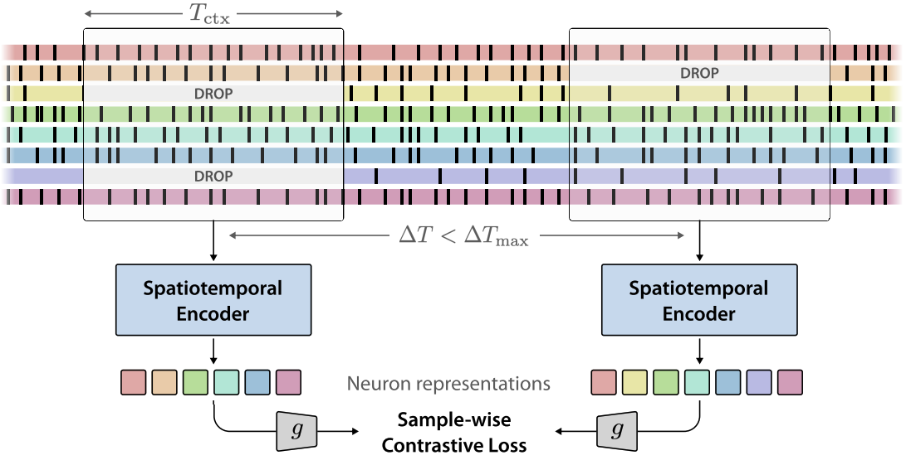

# NuCLR


Official codebase for NuCLR as presented in "Know Thyself by Knowing Others: Learning Neuron Identity from Population Context"

[ [`Project Page`](https://nerdslab.github.io/nuclr) ]
[ [`Paper`](https://arxiv.org/abs/2512.01199) ]
[ [`Poster`](https://neurips.cc/media/PosterPDFs/NeurIPS%202025/115008.png?t=1765324874.3845232) ]
[ [`OpenReview`](https://openreview.net/forum?id=zt3RKc6VBp) ]
[ [`Tweet Thread`](https://x.com/vinam_arora/status/1995930719189959149?s=20) ]

<p align="center">
  
</p>

## Usage

This project has been developed on Python3.10, with environment management using [`uv`](https://docs.astral.sh/uv/getting-started/installation/). To setup the environment, do:

```bash
uv venv venv -p 3.10
source venv/bin/activate
uv pip install -r requirements.txt
```

Follow the steps below to train and evaluate your own NuCLR model.

### 1. Preprocessing Data

1. To preprocess datasets, please follow the steps in `preprocess/README.md`.

2. Download metadata (csv files) about neurons in all four datasets from this [link](https://ik.imagekit.io/7tkfmw7hc/nuclr/neuron_metadata.zip?updatedAt=1747970653540) and unzip into `./neuron_metadata`.

### 2. Training

To train on Electrophysiology data (IBL, Allen, Steinmetz et. al.):

```bash
python train.py --config-name train_ephys data=<data-config> num_epochs=<num_epochs>
```

To train on Calcium Imaging data (Bugeon et. al.):

```bash
python train.py --config-name train_ca data=<data-config> num_epochs=<num_epochs>
```

- We use [Hydra](https://hydra.cc/) for managing configs.
- Options for `<data-config>` can be found in `configs/data/*.yaml`. E.g. `data=ibl_bwm_probes_dev`
- Set `num_epochs` such that the total number of training steps is roughly 50,000.
- The checkpoints would be stored in `../ckpt` by default.
- Other available configurations can be found in `configs/train_ephys.yaml` and `configs/train_ca.yaml`

### 3. Evaluation

A final forward pass over the entire data is needed to get the embeddings from a particular checkpoint.
The training script would print a "run_id" for the corresponding run. Use this to run the following command:

```bash
bash utils/forward_all_epochs.sh <run_id> <data-config-name> [batch_size] [epoch_stride]
```

This would store the embeddings in `../embs/<run_id>/embs_epoch_<num>.pt`.
In most cases, you should use the "transductive" versions of each dataset while gathering these embeddings, since we
want to compute embeddings for all neurons here.

Once you have the embeddings, you can follow the instructions in `eval_scripts/README.md` to run our evaluation scipts.

## Citation

If you find this repository useful in your research, please consider giving a star ⭐ and a citation

```bib
@inproceedings{
    arora2025nuclr,
    title={Know Thyself by Knowing Others: Learning Neuron Identity from Population Context},
    author={Vinam Arora and Divyansha Lachi and Ian J Knight and Mehdi Azabou and Blake Richards and Cole Hurwitz and Joshua H Siegle and Eva L Dyer},
    booktitle={Thirty-ninth Conference on Neural Information Processing Systems},
    year={2025},
    url={https://arxiv.org/abs/2512.01199}
}
```
